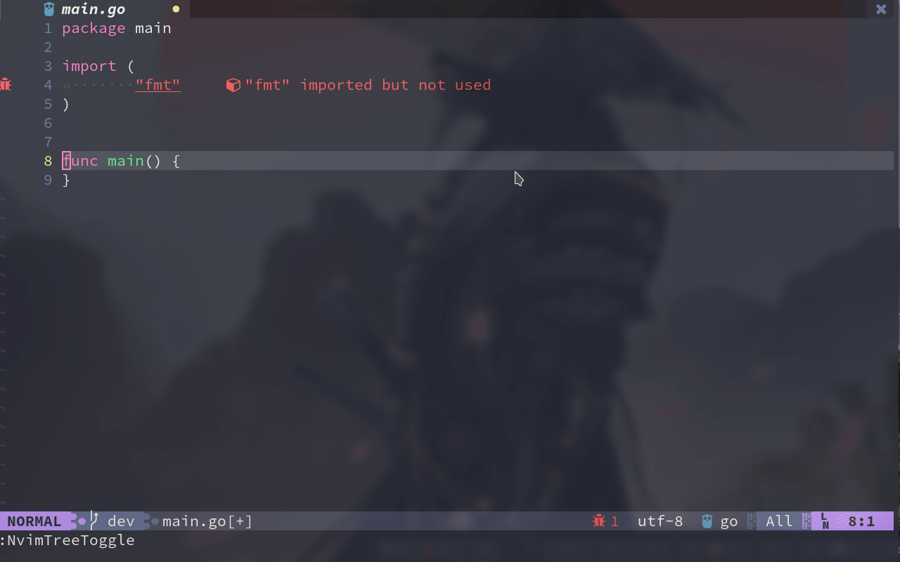

# Neovim

## Installation
1. `stow nvim` inside the `.dotfiles` directory
2. Run `$ ./install.sh` for downloading pluging manager
3. Open nvim and run `:PlugInstall`
4. install powerline symbols and nerd fonts for icon support
